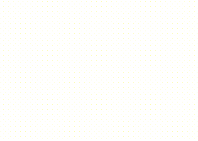

<!DOCTYPE html PUBLIC "-//W3C//DTD XHTML 1.0 Strict//EN" "http://www.w3.org/TR/xhtml1/DTD/xhtml1-strict.dtd">
<html xmlns="http://www.w3.org/1999/xhtml" lang="en">
  <!-- Header -->
  <head>
    <meta http-equiv="Content-Type" content="text/html; charset=utf-8"/>
    <!-- <title>About me</title> -->
  </head>
  <!-- Body -->
  <body>
    <!-- Banner -->
    <!-- Kudos to https://fonts.google.com/specimen/Old+Standard+TT -->
    

      
    

    <!-- Clippy -->
    <!-- Kudos to https://github.com/pi0/clippyjs -->
    

      
    

    <!-- Footer -->
    <!-- Kudos to https://www.w3.org/2000/09/vsimg/transparency-test.html -->
    

      
      
    

  </body>
</html>
